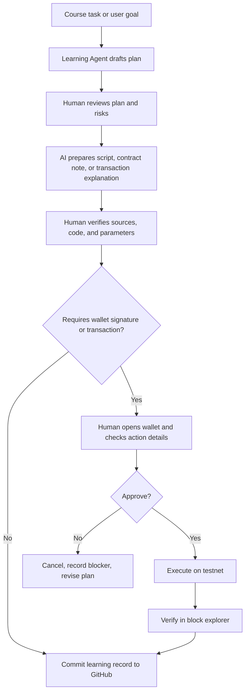

# AI x Web3 Minimal Cross-over Flow

## Goal

Describe the smallest safe workflow that connects AI assistance with Web3 execution while keeping human confirmation in the critical path.

## Flow

## Human Confirmation Points

- Before committing public notes or code
- Before publishing a submission link
- Before creating or using a wallet
- Before signing any message
- Before sending any transaction
- Before deploying or writing to a contract

## Submission Summary

This flow solves the problem of using an AI agent to help with Web3 learning tasks without giving the agent unsafe control over wallet actions. The AI assists with planning, drafting notes, preparing code or transaction explanations, and organizing proof records, while the human checks sources, code, wallet prompts, and public submissions. Any wallet creation, message signing, transaction sending, contract deployment, contract write call, or public submission must be manually confirmed by the human. The final result can be verified through GitHub commits, contract addresses, transaction hashes, and block explorer links. The main risks are hallucinated AI output, wrong transaction parameters, over-broad wallet permissions, leaked secrets, and treating testnet habits too casually when moving toward real assets.

## Logs And Proof

- GitHub commit URL
- Testnet transaction hash
- Contract address
- Block explorer URL
- Screenshot without private keys or seed phrases
- Notes explaining what AI drafted and what the human reviewed

## Failure Recovery

- If AI output is wrong: stop, record the issue, and verify against official docs.
- If wallet details look unexpected: reject the wallet prompt.
- If transaction fails: keep the hash, inspect the failure reason, and write a short postmortem.
- If public notes include sensitive data: remove the data immediately and rotate any exposed credential.
