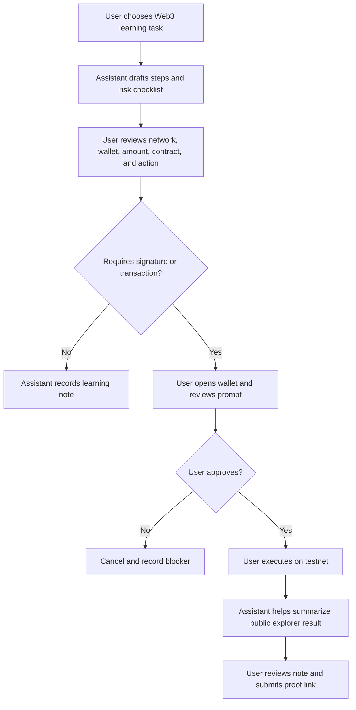

# Restricted Web3 Assistant Workflow

## Goal

Design a small Web3 assistant workflow with clear limits, human confirmation, and public verification.

## Assistant Scope

The assistant can:

- Explain wallet prompts in plain language.
- Draft transaction or contract interaction checklists.
- Read public docs and block explorer pages.
- Summarize transaction metadata such as hash, status, gas, block, from, to, and method.
- Prepare GitHub notes and submission drafts.

The assistant cannot:

- Hold private keys or seed phrases.
- Sign wallet messages.
- Send transactions.
- Deploy contracts without human action.
- Approve token allowances.
- Submit public task forms without human review.

## Minimal Workflow

## Problem Solved

This workflow helps a learner complete simple Web3 practice tasks with AI support while keeping sensitive wallet actions under human control. It is designed for tasks such as preparing a testnet transaction, checking a contract call, reading a block explorer page, and turning the result into a safe public learning record.

## Input And Output Examples

Example input:

> I need to send one Sepolia testnet transaction and submit proof for my Week 1 task. Help me check what to record.

Example assistant output:

> Use a test-only wallet on Sepolia. Before confirming, check the recipient address, amount, network, estimated gas, and whether this is only a testnet transaction. After confirmation, record the transaction hash, status, block number, from/to addresses, value, gas fee, and Etherscan link. Do not include private keys, seed phrases, API keys, tokens, or `.env` files.

Example input:

> I deployed a MinimalStorage contract. Help me prepare a public task record.

Example assistant output:

> Record the contract address, deployment transaction hash, network, constructor value, function called, write transaction hash, explorer links, and which wallet steps were manually confirmed by the human.

## Permission Boundaries

- Network must be testnet for Week 1 experiments.
- Wallet must be a test-only wallet.
- No real funds.
- No private keys or seed phrases in chat, screenshots, repo, or `.env`.
- Human must approve every wallet prompt.
- Public proof should use transaction hashes and explorer links.

## Human Confirmation Points

The human must manually confirm:

- Creating or importing a wallet.
- Switching wallet network.
- Signing any message.
- Sending any transaction.
- Deploying a contract.
- Calling a write function on a contract.
- Approving token allowance or contract permissions.
- Publishing a public submission link.

## Risks And Limits

- The assistant may hallucinate or misread a transaction, so public explorer data should be checked directly.
- A wallet prompt may request a different action than expected, so the human must inspect network, address, amount, method, and permissions.
- Testnet habits can become dangerous on mainnet if the user clicks too quickly.
- The assistant cannot safely judge every smart contract risk from surface metadata alone.
- Screenshots or notes can accidentally expose sensitive information if not reviewed before publishing.

## Verification

Results can be verified by checking:

- GitHub commit history and public Markdown records.
- Transaction hash on a block explorer.
- Contract address on a block explorer.
- Transaction status, block number, from/to addresses, value, gas, and method.
- Whether the public record avoids secrets such as private keys, seed phrases, API keys, tokens, and `.env` files.

## Logging

Each action should produce a record:

- Date
- Task
- Tool used
- Human confirmation point
- Public proof link
- What went wrong or what changed

## Failure Recovery

- Unexpected wallet prompt: reject and inspect.
- Wrong network: cancel and switch network.
- Failed transaction: record hash and failure reason.
- Bad AI explanation: compare with official docs or block explorer raw data.
