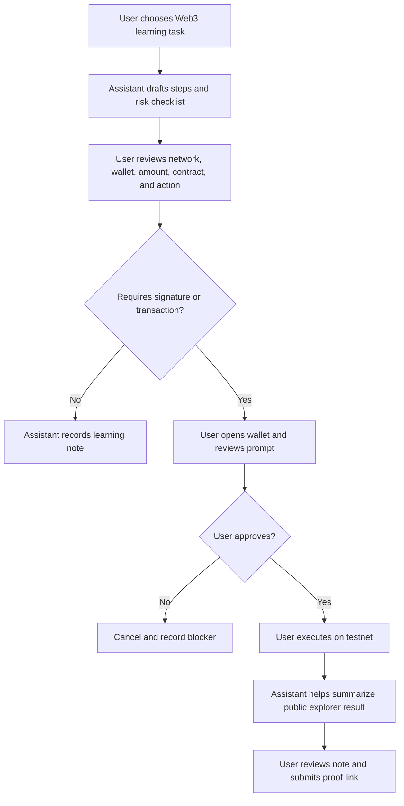

# Restricted Web3 Assistant Workflow

## Goal

Design a small Web3 assistant workflow with clear limits, human confirmation, and public verification.

## Assistant Scope

The assistant can:

- Explain wallet prompts in plain language.
- Draft transaction or contract interaction checklists.
- Read public docs and block explorer pages.
- Summarize transaction metadata such as hash, status, gas, block, from, to, and method.
- Prepare GitHub notes and submission drafts.

The assistant cannot:

- Hold private keys or seed phrases.
- Sign wallet messages.
- Send transactions.
- Deploy contracts without human action.
- Approve token allowances.
- Submit public task forms without human review.

## Minimal Workflow

## Permission Boundaries

- Network must be testnet for Week 1 experiments.
- Wallet must be a test-only wallet.
- No real funds.
- No private keys or seed phrases in chat, screenshots, repo, or `.env`.
- Human must approve every wallet prompt.
- Public proof should use transaction hashes and explorer links.

## Logging

Each action should produce a record:

- Date
- Task
- Tool used
- Human confirmation point
- Public proof link
- What went wrong or what changed

## Failure Recovery

- Unexpected wallet prompt: reject and inspect.
- Wrong network: cancel and switch network.
- Failed transaction: record hash and failure reason.
- Bad AI explanation: compare with official docs or block explorer raw data.

