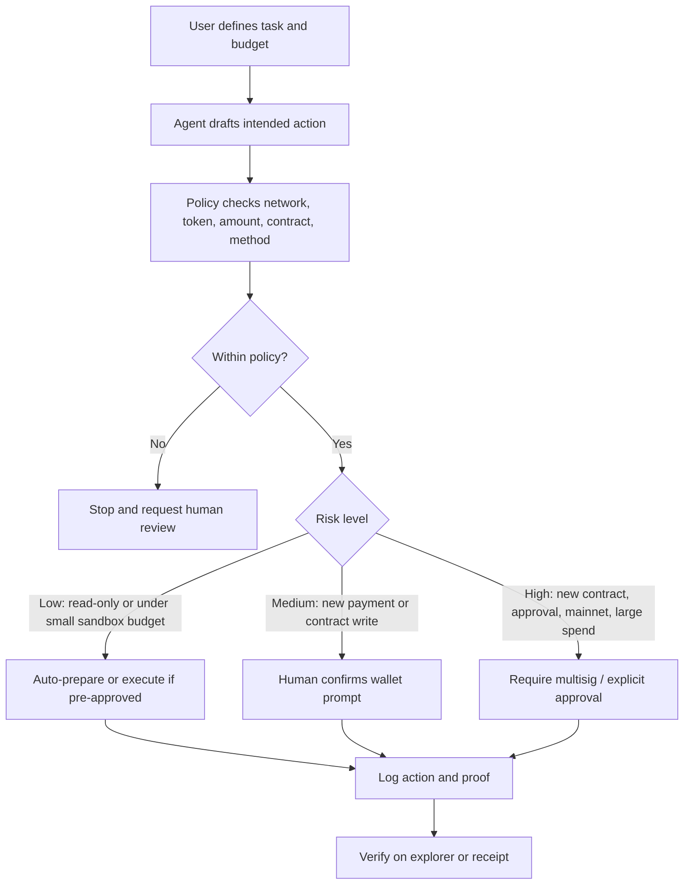

# Week 2 Wallet / Permission: Agent Chain Action Strategy

## Scenario

A research agent may buy low-cost public data or call a known contract method during a learning workflow. The user wants limited automation but does not want to give the agent full wallet control.

## Execution Flow

## Permission Policy

| Dimension | Policy |
| --- | --- |
| Budget | Maximum 2 test USDC/day, maximum 0.5 test USDC/request. Real funds require separate approval. |
| Network | Testnet only by default. Mainnet actions disabled. |
| Token | Only test tokens or explicit allowlist. |
| Callable contracts | Known allowlisted contracts only. No unknown contract calls. |
| Allowed actions | Read calls, small test payments, known API payment, known contract method. |
| Forbidden actions | Private key export, seed phrase handling, unlimited token approval, unknown delegatecall, mainnet transfer. |
| Human confirmation threshold | Any new recipient, new contract, new token, new network, approval, deployment, or amount above limit. |
| Revocation | User can revoke session key, remove allowlist entry, pause policy, or rotate wallet. |
| Logs | Record request id, policy result, tx hash/payment id, method, amount, and human confirmation if any. |
| Failure handling | Cancel on mismatch; record failure reason; require human review before retry. |

## Why ERC-4337 Matters

ERC-4337 account abstraction makes smart accounts possible without changing Ethereum consensus. For agent workflows, the important idea is that account behavior can be programmable: validation logic, sponsored gas, session keys, spending limits, batched actions, and recovery can be implemented at the account layer.

## Why Safe Matters

Safe is important because it gives teams a mature multisig and smart account pattern. It reduces single-key risk and supports policy layers, modules, and review workflows. For agent actions, Safe-like structures can require multiple approvals for high-risk actions while letting low-risk preparation stay fast.

## Why Guard / Policy Mechanisms Matter

Guard and policy mechanisms are the practical enforcement layer. They check whether an action is allowed before execution. This matters because natural-language intent is not enough; the wallet layer must verify concrete fields such as target contract, method selector, value, token, network, expiry, and spending cap.

## Manual Confirmation Points

- Creating a wallet or smart account.
- Creating or changing a session key.
- Adding a new contract, token, network, or recipient to the allowlist.
- Approving token allowance.
- Deploying a contract.
- Sending a mainnet transaction.
- Executing anything above budget.
- Retrying after failed or suspicious execution.

## Verification

- Policy decision is logged.
- Transaction hash or payment id is recorded.
- Explorer confirms status, target, method, amount, and network.
- Human confirmation record exists for medium/high-risk actions.
- Revocation path is tested or documented.

## Safety Boundary

This strategy is a design note only. It does not include private keys, seed phrases, API keys, tokens, `.env` files, or real-asset account information.
