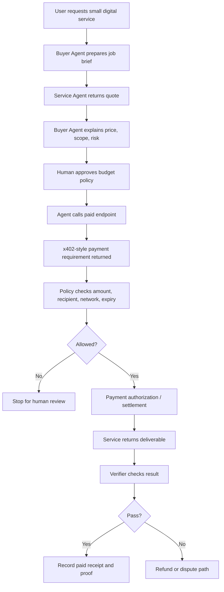

# Week 2 Total Delivery: Direction Deep Dive And Initial Proposal

## Main Direction

**Restricted agent payment and delivery workflow for small digital services.**

The core idea is to let an AI agent help a user buy a small service, such as a public article summary or data lookup, while enforcing strict budget, recipient, network, and confirmation boundaries.

## Problem Map

See the full map:

https://github.com/Connor532/ai-web3-school-cohort-0/blob/main/tasks/week-2-problem-map.md

Covered directions:

- Payment / Commerce / Settlement
- Identity / Reputation / Capability
- Wallet / Permission / Safe Execution
- Privacy / Security / Sovereignty
- Dev Tooling / Agent Workflow
- Governance / Coordination / Public Goods

## Why This Is Not Pure AI Or Pure Web3

It is not pure AI because the hard part is not only planning or summarizing. The system needs payment authorization, settlement, receipts, refunds, dispute handling, and verifiable records.

It is not pure Web3 because payment rails and smart contracts do not understand task intent, service quality, delivery format, or whether the user actually got what they asked for.

## Participants

| Participant | Role |
| --- | --- |
| User | Defines task, budget, and acceptable risk. |
| Buyer Agent | Prepares request, checks quote, records proof. |
| Service Agent | Performs paid task and returns deliverable. |
| Wallet / Policy Layer | Enforces budget, network, token, recipient, method, and expiry. |
| Verifier | Checks delivery before final settlement. |
| Arbiter / Governance | Handles dispute or refund path. |

## Flow Diagram

## AI Role

- Convert user goal into a structured job.
- Compare quote with budget policy.
- Explain payment and wallet prompts.
- Check delivery format and source links.
- Draft proof records and submission notes.

## Web3 Mechanism

- Wallet or smart account holds payment authority.
- Policy/pact limits spend, network, recipient, and action type.
- x402-style flow communicates payment requirement.
- ERC-8004-style registry can help identify service agents.
- ERC-8183-style commerce flow can coordinate client, provider, evaluator, and settlement.
- Block explorers or payment receipts provide verification.

## Automation Boundary

Can automate:

- Reading public sources.
- Drafting quote summary.
- Checking against a pre-approved policy.
- Calling read-only endpoints.
- Recording receipts and proof.

Must be manually confirmed:

- Initial budget policy.
- Any wallet signature or transaction outside sandbox limits.
- New recipient, token, network, or contract.
- Token approval.
- Mainnet or real-asset action.
- Final dispute or refund decision.

## Initial Product Proposal

### Name

`ProofPay Agent`

### Target Users

- AI x Web3 learners.
- Small research communities.
- Builders buying small API/data/research tasks.

### Real Scenario

A learner needs a short public-source research note about a protocol. Instead of subscribing to a full SaaS product, the learner lets a restricted agent pay a small amount for one API result, verify the returned content, and record the receipt in a GitHub proof pack.

### Minimum Features

- Job brief generator.
- Quote and payment requirement parser.
- Budget policy checker.
- Manual confirmation gate.
- Delivery verifier.
- Receipt/proof recorder.

### Validation Plan

1. Simulate the paid API response with a mocked `402 Payment Required` object.
2. Run the policy checker against allowed and blocked cases.
3. Produce a public-safe receipt record.
4. Have a human review whether the agent should pay.
5. Later replace mock payment with testnet payment only.

### Main Risks

- Agent pays for wrong service.
- Policy is too broad.
- Delivery quality cannot be objectively verified.
- Payment receipt leaks private context.
- User over-trusts the agent on mainnet.

### Possible Hackathon Track

- Agent wallet / permission.
- Agentic payment.
- AI x Web3 tooling.
- Security / verification workflow.

## Typical Scenario

The user asks for a summary of one public protocol article with a maximum budget of 0.5 test USDC. The service returns a payment requirement. The agent checks the recipient, price, network, and resource. If the policy allows it, the agent proceeds in sandbox mode. If anything changes, it stops for human confirmation.

## Counterexample

The same workflow should reject a request where the service changes from `0.1 USDC on testnet` to `10 USDC on mainnet`, or where the resource asks the agent to approve unlimited token spending. This is not a "small automatic payment" anymore; it is a high-risk wallet action.

## Reference List

| Reference | How It Helps |
| --- | --- |
| x402 docs: https://docs.x402.org/core-concepts/http-402 | Helps model HTTP-native payment requirement and retry flow. |
| x402 overview: https://www.x402.org/ | Helps understand pay-per-use API and agent payment positioning. |
| Cobo Agentic Wallet / CAW: https://www.cobo.com/post/cobo-launches-agentic-wallet-how-ai-agents-interact-on-chain | Helps think about scoped wallet authority for agents. |
| ERC-8004: https://eips.ethereum.org/EIPS/eip-8004 | Helps frame agent identity, reputation, and validation. |
| ERC-8183: https://eips.ethereum.org/EIPS/eip-8183 | Helps frame client / provider / evaluator commerce coordination. |
| Safe docs: https://docs.safe.global/home/overview | Helps frame multisig and high-risk approval workflows. |
| ERC-4337 docs: https://docs.erc4337.io/ | Helps frame programmable smart account validation and session permissions. |

## Direction Backlog

| Direction | Why Not Main Direction Yet |
| --- | --- |
| Governance summarizer | Valuable, but less directly connected to on-chain payment practice. |
| Privacy-preserving agent memory | Important, but too broad for my current Week 2 implementation level. |
| Dev tooling agent for smart contracts | Useful, but I already explored Remix and minimal contracts in Week 1; payment/permission feels more new. |

## Safety Boundary

This proposal does not include private keys, seed phrases, API keys, tokens, `.env` files, private course links, or real-asset account information.
