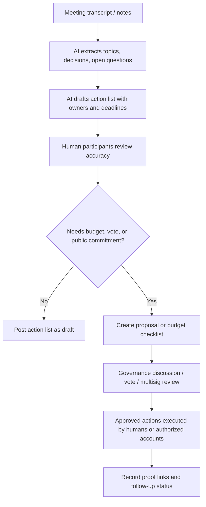

# Week 2 Governance / Coordination Workflow

## Scenario

A DAO or learning community needs to turn meeting notes and proposals into clear actions without letting AI make governance decisions. I choose a **meeting-to-action workflow** for an AI x Web3 learning community.

## Workflow

## AI-Assisted Steps

- Summarize meeting notes.
- Extract decisions and unresolved questions.
- Draft action items.
- Group tasks by owner, deadline, and risk.
- Prepare proposal summaries.
- Build a budget execution checklist.

## Human / Governance Confirmation Steps

- Confirm whether AI summary is accurate.
- Confirm action owners and deadlines.
- Approve public statements.
- Approve budget movement.
- Vote on governance proposals.
- Confirm multisig transactions.
- Resolve disputes about contribution credit.

## Example Output

| Item | AI Draft | Human/Governance Required |
| --- | --- | --- |
| Proposal summary | AI summarizes problem, options, and tradeoffs. | Author confirms it does not misrepresent intent. |
| Contribution tracker | AI groups commits, notes, and demos by contributor. | Maintainers confirm credit and quality. |
| Budget checklist | AI lists recipient, amount, purpose, proof, and risk. | DAO vote or multisig confirms payment. |
| Follow-up tasks | AI drafts owners and deadlines. | Owners accept responsibility. |

## What Is Only AI Summary

- "The proposal seems to support X."
- "The main concern appears to be Y."
- "These contributors may be related to the task."
- "This budget item matches the meeting notes."

These statements are drafts and must be reviewed.

## What Requires Human Or Governance Confirmation

- Final proposal text.
- Official community announcements.
- Contributor rewards.
- Budget transfer.
- Multisig execution.
- Dispute resolution.
- Long-term roadmap decisions.

## Verification

- Link proposal, meeting notes, vote, transaction, or multisig execution.
- Record who reviewed the AI summary.
- Track changes between AI draft and final accepted version.
- Mark unverified AI summaries clearly as drafts.

## Main Risks

- AI may summarize a proposal in a biased or incomplete way.
- Quiet contributors may be missed if proof is scattered.
- Budget execution can be risky if recipient or amount is wrong.
- Governance participants may rubber-stamp AI output.
- Public notes may leak private meeting content.

## Safety Boundary

This design does not include private keys, seed phrases, API keys, tokens, `.env` files, private meeting links, or real budget execution credentials.
