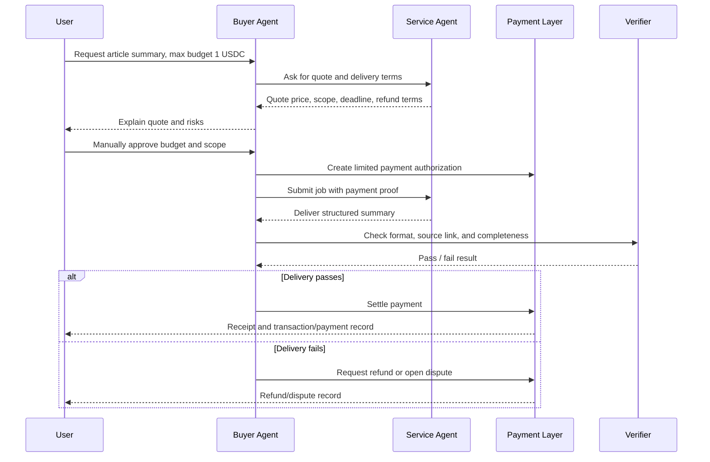

# Week 2 Payment / Commerce Flow

## Scenario

A learner asks a research agent to summarize one public AI x Web3 article and return a structured note. The service costs a small fixed fee. The goal is to design a minimum commerce flow where the user keeps budget control and the agent/service produces verifiable delivery records.

## Participants

| Participant | Role |
| --- | --- |
| User / Buyer | Requests the task, sets budget, reviews delivery, approves payment rules. |
| Buyer Agent | Turns the user request into a structured job, checks price and risk, records proof. |
| Service Agent / Seller | Performs the article summary task and returns the deliverable. |
| Payment Layer | Handles payment requirement, authorization, settlement, refund, or dispute record. |
| Verifier / Human Reviewer | Checks whether the result matches the requested scope. |
| Arbiter / Governance Layer | Handles disputes if delivery is missing, wrong, or unsafe. |

## Minimum Flow

## Required Components

| Stage | Minimum Requirement |
| --- | --- |
| Quote | Price, task scope, deadline, refund rule, seller identity. |
| Budget Authorization | Maximum amount, token/network, expiry time, allowed recipient/service. |
| Execution | Buyer agent submits only the approved task. |
| Delivery | Seller returns summary, source link, timestamp, and receipt id. |
| Verification | Human or verifier checks scope and quality before final settlement. |
| Payment / Refund / Dispute | Payment settles only if delivery passes; otherwise refund or dispute path starts. |
| Proof Record | Store payment id, delivery hash/link, verifier result, and final status. |

## Protocol Comparison

| Protocol / Standard | Useful Segment | What It Helps With | Limit |
| --- | --- | --- | --- |
| x402 | Payment request and API paywall | A server can return `402 Payment Required` with payment terms, then the client retries with payment proof. | It handles payment negotiation, not full service quality or dispute resolution. |
| ERC-8004 | Agent identity and trust | Agents can publish identity, service metadata, reputation, and validation signals. | Identity/reputation does not guarantee this specific task is correct. |
| ERC-8183 | Agentic commerce workflow | Defines client/provider/evaluator style work and payment coordination. | Still needs concrete implementation, UI, risk policy, and verification rules. |

## Manual Confirmation Points

- Approving the maximum budget.
- Approving the token/network and recipient/service identity.
- Accepting any payment authorization.
- Releasing payment if the verifier is uncertain.
- Approving refund or dispute resolution.
- Moving from testnet/sandbox to any real-asset environment.

## Verification

- Quote and terms are stored in a public-safe note or receipt.
- Payment record or transaction hash can be checked.
- Delivery link/hash matches the job id.
- Verifier decision is recorded.
- Final status is one of `paid`, `refunded`, `disputed`, or `cancelled`.

## Main Risks

- The agent pays for the wrong service or wrong amount.
- The seller returns low-quality or copied output.
- A malicious paywall changes payment terms after quote.
- The buyer agent leaks private task context.
- The user treats testnet/sandbox habits as safe for real funds.

## Safety Boundary

This is a design exercise. It does not contain private keys, seed phrases, API keys, tokens, `.env` files, or real payment credentials.
