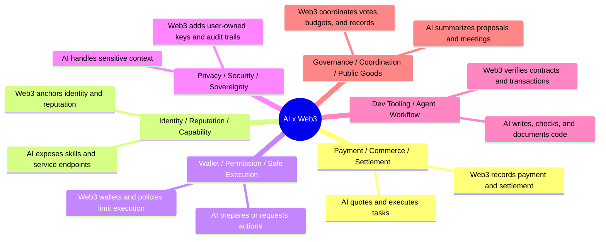

# Week 2 Problem Map: AI x Web3 Direction Choice

## Goal

Map several AI x Web3 directions, explain the AI role and Web3 mechanism in each direction, then choose one main Week 2 direction for deeper work.

## Problem Map

## Direction Table

| Direction | AI Role | Web3 Mechanism | Why It Matters |
| --- | --- | --- | --- |
| Payment / Commerce / Settlement | Understand user intent, quote a task, execute a service, produce a delivery record. | Wallets, stablecoin payments, x402-style paywall, escrow or settlement receipts. | Agents need a native way to pay and get paid for small tasks. |
| Identity / Reputation / Capability | Describe what an agent can do, publish endpoint and capability metadata, collect feedback. | Agent profile, on-chain registry, reputation records, signed attestations. | Users and other agents need to know who they are calling and whether to trust it. |
| Wallet / Permission / Safe Execution | Prepare actions and ask for limited permissions. | Smart accounts, Safe, ERC-4337 account abstraction, guards, policies, session keys. | Agents should not receive unlimited wallet control. |
| Privacy / Security / Sovereignty | Handle private instructions, detect risk, avoid leaking sensitive data. | Key custody, wallet confirmation, scoped permissions, audit logs, revocation. | Agent automation can amplify mistakes and leaks. |
| Dev Tooling / Agent Workflow | Draft contracts, tests, docs, and deployment records. | GitHub commits, block explorers, testnets, verified contracts, CI. | Builders need reproducible proof, not only chat transcripts. |
| Governance / Coordination / Public Goods | Summarize proposals, meetings, contribution records, and budget options. | DAO votes, multisigs, public ledgers, proposal forums, contribution proofs. | Communities need better coordination without outsourcing final decisions to AI. |

## Two Directions That Are Not Pure AI Or Pure Web3

### Payment / Commerce / Settlement

This is not a pure AI problem because language models can plan and execute tasks but cannot by themselves create reliable settlement, receipts, refunds, or dispute records. It is also not a pure Web3 problem because payment rails alone do not understand user intent, service quality, task completion, or natural-language negotiation.

### Wallet / Permission / Safe Execution

This is not a pure AI problem because an agent cannot safely decide every wallet action without technical limits, revocation, and audit trails. It is not a pure Web3 problem because smart accounts and policies need a human-readable layer that explains actions, risk, and intent before confirmation.

## Main Direction For Week 2

I choose **Payment / Commerce / Settlement with restricted agent permissions** as my Week 2 main direction.

The concrete product question:

> How can a user authorize an AI agent to buy a small digital service, receive the result, and keep a public/auditable proof trail, without giving the agent broad wallet control?

This direction connects the rest of Week 2:

- Agent identity: what service or assistant is being called?
- Payment flow: how is price, budget, delivery, settlement, refund, or dispute handled?
- Wallet permission: what can the agent spend and call?
- Security/privacy: what must be blocked or manually confirmed?
- Governance: how could a community review service quality or handle disputes?

## Safety Boundary

This document is a design note only. It does not include private keys, seed phrases, API keys, tokens, `.env` files, or real-asset account information.
