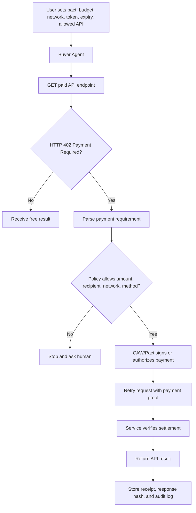

# Week 2 Advanced Design: x402 Paywall + CAW Agent Payment Loop

## Goal

Design a minimum x402 paywall + Cobo Agentic Wallet style payment loop. I am submitting an architecture and pseudo-flow rather than a live payment demo, because the key learning goal is controlled autonomy: automatic execution only inside explicit budget, scope, time, and audit boundaries.

## Design Summary

The service provider exposes a paid API endpoint. The buyer agent requests the endpoint, receives a `402 Payment Required` response, checks the payment requirement, asks whether the request fits the user's pre-approved pact, pays only if policy allows it, retries the request with payment proof, receives the result, and records the receipt.

## Architecture



## Example API Flow

```text
1. Agent requests:
   GET /premium/ai-web3-risk-note

2. Server responds:
   402 Payment Required
   payment_required = {
     amount: "0.10",
     currency: "USDC",
     network: "base-sepolia",
     recipient: "service-agent-address",
     resource: "/premium/ai-web3-risk-note",
     expires_at: "2026-05-30T23:59:00Z"
   }

3. Agent checks pact:
   max_per_request <= 0.50 USDC
   daily_budget <= 2.00 USDC
   allowed_recipient == service-agent-address
   allowed_resource == /premium/ai-web3-risk-note
   network == base-sepolia

4. If allowed, payment is authorized and attached.

5. Server settles or verifies payment and returns the result.

6. Agent records:
   payment id, response hash, timestamp, policy decision, and final status.
```

## Pact / Policy Sketch

```json
{
  "agent": "research-buyer-agent",
  "allowed_networks": ["base-sepolia"],
  "allowed_tokens": ["USDC-test"],
  "allowed_recipients": ["service-agent-address"],
  "allowed_resources": ["/premium/ai-web3-risk-note"],
  "max_per_request": "0.50",
  "daily_budget": "2.00",
  "expires_at": "2026-06-02T00:00:00Z",
  "manual_confirmation_required_if": [
    "amount > max_per_request",
    "new recipient",
    "new network",
    "new token",
    "new contract",
    "missing receipt",
    "ambiguous service description"
  ]
}
```

## Human Confirmation Points

- Creating or approving the initial pact.
- Increasing the budget.
- Adding a new recipient, token, network, or resource.
- Retrying after a failed or unclear payment.
- Paying on mainnet or with real funds.
- Disputing delivery or releasing funds after failed verification.

## Audit Record

Each run should save:

- Request id.
- Resource path.
- Payment requirement.
- Policy decision.
- Payment/settlement id or transaction hash.
- Response hash.
- Human confirmation record if triggered.
- Final status.

## Risk Boundaries

- x402 can express payment requirement, but it does not by itself prove result quality.
- CAW/Pact style limits reduce blast radius, but a bad policy can still authorize bad payments.
- Prompt injection could ask the agent to buy a different resource.
- A service could change price, recipient, or network between quote and retry.
- Receipts must avoid leaking private prompts, user data, or account information.

## Reference Notes

- x402 docs: https://docs.x402.org/core-concepts/http-402
- x402 overview: https://www.x402.org/
- Cobo Agentic Wallet / CAW overview: https://www.cobo.com/post/cobo-launches-agentic-wallet-how-ai-agents-interact-on-chain
- ERC-8183: https://eips.ethereum.org/EIPS/eip-8183

My interpretation:

- x402 uses HTTP `402 Payment Required` to communicate payment requirements and enable programmatic client retries with payment proof.
- Cobo Agentic Wallet / Pact is useful as a policy and custody layer for agent-controlled actions.
- ERC-8183 is relevant as an agentic commerce pattern involving client, provider, evaluator, and payment coordination.

## Safety Boundary

This document is an architecture sketch. It does not include private keys, seed phrases, API keys, tokens, `.env` files, or real payment credentials.
